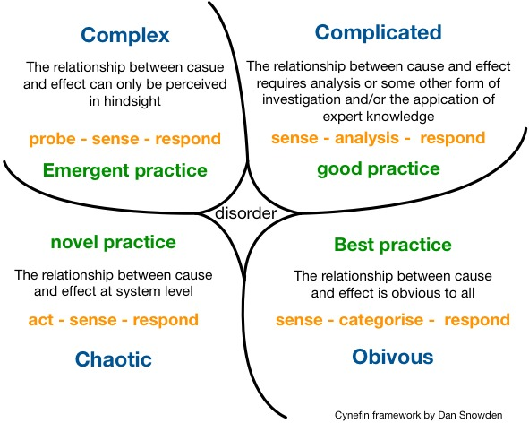

# 特性分支：代码混乱到业务失控

在多数公司的开发流程中，我们通常会选择一种被称为**特性分支**来管理我们的变更。它整体的开发流程如下：
1. 开发在接到需求后拉出对应编号的特性分支（比如 feat/1234）
2. 开发完成后，会合并到 QA 分支。QA 测试通过后，再合并到主干分支（master/main）。并切出一个迭代版本（v7.0.1）用于发布。还在开发中的需求，则需要在发布后重新 rebase 主干分支
3. 如果生产环境出现问题，会从发布分支的基础上拉出一个 fix 分支（比如 fix/42344），进行修复。
4. 修复后会合并发布分支，并发布修复。

我们平时可能使用 develop 或者 release 作为主干分支。但是只要**拉出来的特性分支长时间没有合并回主干，就相当于没有做持续集成，所谓 Devops 也就是一种形式上的空话**

## 假重构：不负责任的 kpi

这种开发模式我们习以为常，但却每天承受着其带来的诸多问题。

首先是**延迟集成与合并地狱**，特性分支的生命周期通常较长（从几天到数月不等），导致其与主干代码或者别的特性分支的差异逐渐积累。当多个分支同时合并时，冲突的解决成本呈指数级上升，甚至可能引发不可预见的系统故障。分支的延迟集成违反了持续交付的核心原则——“小步快跑”，而“合并地狱”本质上是技术债务的集中爆发。

其次是**虚假的安全感与质量陷阱**，特性分支的隔离性表面上降低了代码冲突风险，但实际上掩盖了代码质量问题。开发人员在分支上可以随意编写临时补丁，但这些代码在合并到主干前缺乏全局验证。DORA报告指出，高绩效团队的代码集成频率是低绩效团队的200倍以上，而特性分支模式恰恰是低频率集成的典型代表。

最后就是**重构的死亡螺旋**，重构本应是代码健康的核心手段，但在特性分支模式下，重构成为高风险行为。例如，团队试图清理遗留系统中的冗余代码，但因多个特性分支同时修改同一模块，最终合并时冲突无法解决，被迫放弃重构并引入更多临时逻辑。代码越复杂，重构越困难；重构越少，代码越腐化——特性分支将团队拖入这一深渊。

更糟糕的是，随着业务复杂度的增加，我们的特性分支的生命周期会变得越来越长，上面的问题会变得愈发严重，自然交付效率也不可能上的去。

可以说，在特性分支的模式下，我们的代码变更只是在让发布分支变得更加混乱。**选择特性分支，就是选择了越来越低的交付效率，就等于是放弃重构（或者做一个阵仗很大的假重构）、放弃代码（产品）的未来**。

## 主干开发：越是痛苦的事情越是要频繁做

到今天为止，持续集成、持续交付、持续部署已经成为公认的优秀实践了， 通过自动化的方式，让我们的代码在每一次提交后，都能自动化地走完编译、测试流程，完成后即可随时准备发布。而其中很重要的模式，即是主干开发。

主干开发（Trunk-Based Development）是持续集成的基石，其核心在于**高频次集成、小批量提交、高频次验证**。
1. 代码push或PR合并到主干或公共分支后，触发流水线进行集成和构建，产生制品。
2. 通过流水线将这个制品部署到测试环境，开始测试。
3. 测试通过后，将相同的制品部署到下一个测试环境（如集成环境）进行测试。
4. 测试通过后，还是相同的制品，继续晋级到下一个测试环境（如验收环境或准生产环境）
5. 如此类推，直到这个制品最终部署到生产环境。

所有的构建和部署都是在单一流水线上执行，当然部署环节可能需要手工触发。**同样一个制品通过在不同环境的测试和验证，最终晋级生产环境**。这样我们才能确保最终部署到生产环境的包是通过层层验证的、有质量信心的包

这样的开发模式为我们带来了诸多好处：
1. **快速反馈**：每次提交均触发自动化测试与构建，问题在数分钟内暴露。
2. **冲突最小化**：高频集成迫使开发者频繁同步主干代码，冲突被分解为小问题而非集中爆发。
3. **可发布性**：主干始终处于可部署状态，包回滚和包发布都非常高效。

然而，很多团队却难以落地主干开发：

主观上来讲，就是程序员职业素养的不足，多数人并没有能力覆盖单元测试、集成测试与端到端测试。这个是和英语一样需要长期训练的能力，大部分人都是学了一段时间就荒废了。而且因为学期周期长，反馈频率低，很难写进绩效里，自然很少有人能坚持下来。

客观上来讲，**即使程序员通过互联网学会了测试驱动开发，也会发现很难应用到现实业务中**。因为测试驱动开发取决于如何理解业务，并按照特定的规则进行合理的任务分解。互联网的 TDD 教程，一般是以某一个独立的工具库作为教程，但我们平时都是在对现实变化的业务进行分解。可以学到技巧，但实际应用还是要费点力。因为多数情况下，我们既没有合理理解业务的方式，整个团队下也没有统一的架构规则。最好的情况下，也只是写一套测试完备，但是只有自己能理解的代码。
## 以终为始：提炼业务，梳理架构，传递知识

当我们接收到一个任务时，我们会根据对已有项目的理解，进行一轮详细的拆解，所谓拆解的难点则在于**理解软件隐藏的复杂度：这个业务做了什么，以及这个业务是如何完成的**。我们平时真的有做好拆解吗？

在软件复杂度治理中，有一个被称为 Cynefin 的框架，把我们在软件开发中的各种**行为模式**，分为了四个主要区别：清晰（Clear）、庞杂（Complicated）、复杂（Complex）、混乱（Chaotic）模式。

Clear
- 特点：因果关系明确，问题有已知的解决方案，可以通过最佳实践解决。
- 例子：
	- 编写简单的脚本：例如用Python写一个文件重命名工具，步骤清晰，结果可预测。
	- 安装软件：按照官方文档的步骤安装和配置软件。
	- 使用版本控制：按照Git的标准流程提交代码和创建分支。
Complicated
- 特点：因果关系需要分析或专业知识，可能有多个正确答案，需要专家意见或良好实践，也就是所谓的“经验之谈”。
- 例子：
    - 优化数据库性能：需要分析查询语句、索引和数据库结构，可能需要DBA的专业知识。
    - 设计系统架构：需要根据业务需求和性能要求设计复杂的分布式系统。
    - 调试复杂Bug：需要通过日志分析、代码审查和工具调试来定位问题。
Complex
- 特点：因果关系不明确，问题无法提前预测，需要通过实验和探索来发现解决方案。
- 例子：
	- 开发创新功能：例如开发一个基于AI的推荐系统，需要通过用户反馈和实验不断优化算法。
	- 敏捷开发：通过迭代和用户反馈逐步完善产品。
	- 应对未知的技术挑战：视频平台实现推荐算法。
Chaotic
- 特点：没有明显的因果关系，需要立即采取行动以恢复秩序。
- 例子：
	- 服务器宕机：需要立即重启服务或切换到备用服务器。
	- 安全漏洞被利用：需要紧急修复漏洞并防止进一步攻击。
	- 生产环境数据丢失：需要快速恢复数据并排查原因。

对于一个良好的拆解流程，大多数情况下应该保持在 Complicated 状态。当我们接受到一个需求时，我们需要在**彻底理解已有系统有哪些功能，以及技术上是如何分层实现**的情况下，将其构造为可以执行的软件。只有在极少数情况下，例如极致的性能优化或需要学习外部工具才能完成功能这些超出自己的能力的内容，我们才会进入 **Complex** 模式。

这里就体现出了软件工程真正的难点了，那就是**如何传递并处理业务知识的复杂度**，而非用学习什么语言或者什么框架。

我们前几年流行的“全栈工程师”，就是典型的方向错误的职位，误导了很多技术人的学习方向。

首先“全栈”是一个很难定义的职位，angular + java 是全栈，react + nest 是全栈，python + vue 也是一个全栈，我们现在大模型开发也可以说是一个全栈。企业并没有很好的招聘标准，只能通过最多人用的技术栈以及相关的各种八股文，在很有限的范围内去筛选人才。候选人也会觉得越来越卷，学的越来越累。

其次“全栈”并没有带来预期的期望，企业招全栈工程师的核心目的，就是为了减少人力成本。企业的愿景无非是“一个人顶两个人，全都可以做” 或者是 “各端的代码都能看得懂，可以降低不同部门的沟通成本”。最终带来的效益提升，实际效果也仅限于“看的懂语法”（甚至很多人对面向对象的理解，还停留在大学的 animal dog cat 上）。至于背后的业务知识，依旧没有有效的传递下来。我们依旧在无休止的无效会议中，浪费大量时间。

## 面向业务设计：以模型传递业务知识

为了有效传递业务知识，同时也为了避免写很多不必要的文档（敏捷开发原则之一）。我们需要一种工具，既可以作为技术开发功能的指导，也方便业务和技术在相同认知下互相讨论需求。那么**精炼业务流程和功能转化的领域模型**和**基于领域模型构造的统一语言**，自然是我们的最佳选择。

1.  以模型反应软件实现（Implementation）的结构，这样新人**只要理解了模型，就能大致理解代码的结构**。
2. 以模型为基础，形成团队的统一语言（Ubiquitous Language），**方便研发在讨论需求时更容易明白需要改动的代码，从而更好的评估风险与进度**。
3. 以模型用于抽象知识，相比**代码本身有着更低的传递成本**。

看上去很美好是吧，但是这里的难点有两个，首先是有没有什么能够和业务方（产品，销售，客户等）愉快沟通业务的方式。隔行如隔山，一旦两边坐在一起，难免会因为理解不了对方的专业名词无法顺畅沟通下去。另一个则是，有没有什么能够映射模型的实现方式，不光能映射，而且要让技术都认可其合理性，这样才能有效传递统一的架构实现。

当然最重要的，还是如何降低其团队传递的成本。

## 唯有高质量的代码，才能支撑可信的产品

在 2019 年任正非的《全面提升软件工程能力与实践，打造可信的高质量产品》（那时还没毕业，后悔没有早点看到）中讲到

“我们要从最基础的编码质量做起，视高质量代码为尊严和个人声誉。代码就像是高楼大厦的一砖一瓦，没有高质量的代码，可信的产品就是空中楼阁。我们要优化并遵循公司各种编程规范，遵从架构与设计原则，熟练使用各种编程库和 API，编写出简洁、规范、可读性强、健壮安全的代码。”

所谓可读性强，至少能够表达现实业务。所谓健壮与安全，则需要按照企业架构模式，在足量的测试用例下去开发。这些能力往往是做技术的人会忽略的，同样也是多数公司不会去问的。既然环境没有，不如我们成为企业中第一个写出高质量代码的人